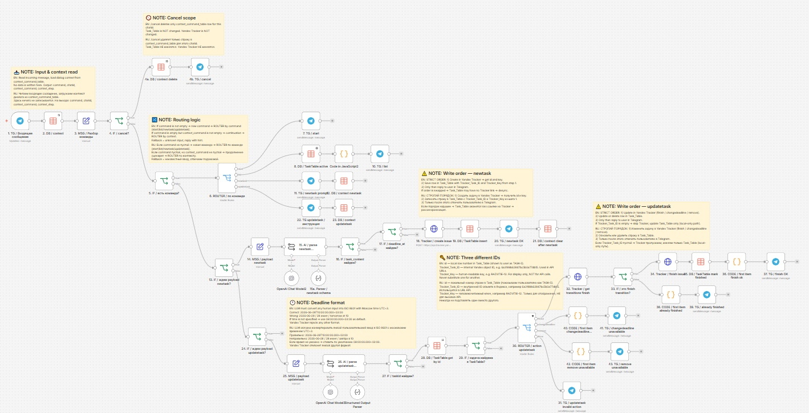
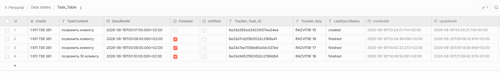
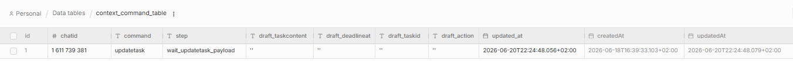
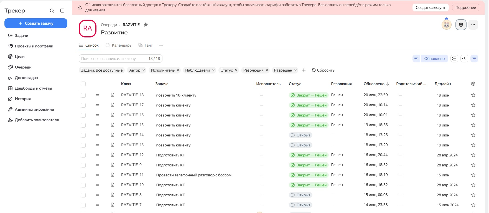

# Tracker Telegram Bot для n8n

n8n-воркфлоу, который связывает Telegram-бота с Яндекс Трекером.
Пользователь создаёт и обновляет задачи через обычные сообщения в Telegram. AI автоматически извлекает текст задачи и дедлайн.

## Обзор

Воркфлоу объединяет Telegram, n8n, OpenAI и Яндекс Трекер в единый сценарий управления задачами.
Бот принимает команды, сохраняет состояние диалога между сообщениями, создаёт задачи в Яндекс Трекере и хранит данные синхронизации в локальных Data Tables.

## Сценарий использования

Вместо того чтобы открывать Яндекс Трекер вручную, пользователь отправляет сообщение в Telegram, например `/newtask позвонить клиенту, дедлайн завтра в 10:00`. Воркфлоу разбирает текст, создаёт задачу в Яндекс Трекере и сохраняет метаданные в `Task_Table`.

## Архитектура

| Компонент | Инструмент |
|---|---|
| Движок автоматизации | n8n |
| Мессенджер | Telegram Bot API |
| Трекер задач | Yandex Tracker API |
| AI-разбор | OpenAI (GPT) |
| Хранилище данных | n8n Data Tables |

Каждое сообщение проходит через следующий pipeline:

1. **Telegram Trigger** — принимает входящее сообщение.
2. **Парсер команд** — определяет `/start`, `/newtask`, `/updatetask`, `/list`, `/cancel`.
3. **Хранилище контекста** — читает и обновляет текущее состояние диалога из `context_command_table`.
4. **AI-парсер** — извлекает структуру задачи и дедлайн из произвольного текста.
5. **Интеграция с Яндекс Трекером** — создаёт или обновляет задачи через API.
6. **Хранилище задач** — сохраняет и обновляет метаданные в `Task_Table`.

## Модель данных

### Task_Table

Хранит все задачи, созданные через бота, с привязкой к Яндекс Трекеру.

| Поле | Тип | Описание |
|---|---|---|
| `chatid` | number | Telegram chat ID пользователя |
| `TaskContent` | string | Текст задачи |
| `DeadlineAt` | dateTime | Дедлайн в формате ISO 8601 |
| `Finished` | boolean | Задача отмечена как завершённая |
| `notified` | boolean | Пользователь уведомлён |
| `Tracker_Task_ID` | string | Внутренний объектный ID задачи в Яндекс Трекере (используется в API-запросах) |
| `Tracker_Key` | string | Читаемый ключ задачи, например `RAZVITIE-15` (только для отображения) |
| `LastSyncStatus` | string | Последний статус синхронизации: `created`, `finished` |

### context_command_table

Хранит текущее состояние диалога для каждого пользователя. Позволяет вести многошаговое взаимодействие между отдельными сообщениями.

| Поле | Тип | Описание |
|---|---|---|
| `chatid` | number | Telegram chat ID пользователя |
| `command` | string | Активная команда, например `updatetask` |
| `step` | string | Текущий шаг диалога, например `wait_updatetask_payload` |
| `draft_taskcontent` | string | Временный черновик текста задачи |
| `draft_deadlineat` | string | Временный черновик дедлайна |
| `draft_taskid` | string | ID редактируемой задачи |
| `draft_action` | string | Запланированное действие: `finish`, `changdeadline`, `remove` |
| `updated_at` | dateTime | Время последнего обновления записи контекста |

## Идентификаторы задач

У каждой задачи три идентификатора — важно не путать их:

| ID | Поле | Пример | Назначение |
|---|---|---|---|
| ID строки в локальной таблице | `id` | `1` | Внутренняя ссылка в n8n |
| Объектный ID Яндекс Трекера | `Tracker_Task_ID` | `6a33d392ed24231007ea34ea` | Используется в API-запросах к Яндекс Трекеру |
| Читаемый ключ задачи | `Tracker_Key` | `RAZVITIE-15` | Отображается пользователю в сообщениях Telegram |

## Очередь в Яндекс Трекере

## Команды

| Команда | Описание |
|---|---|
| `/start` | Показывает приветственное сообщение |
| `/newtask` | Запускает сценарий создания задачи |
| `/updatetask` | Запускает сценарий обновления задачи |
| `/list` | Показывает активные задачи |
| `/cancel` | Отменяет текущую операцию и очищает контекст диалога |

## Логика работы

### Создание задачи (`/newtask`)

1. Пользователь отправляет `/newtask` с описанием задачи.
2. AI разбирает текст и дедлайн.
3. Задача создаётся в Яндекс Трекере.
4. Метаданные сохраняются в `Task_Table`.
5. Бот отвечает с ключом задачи и подтверждением дедлайна.

### Обновление задачи (`/updatetask`)

1. Пользователь отправляет `/updatetask`.
2. Бот запрашивает номер задачи из списка `/list`.
3. Пользователь выбирает действие: завершить, изменить дедлайн или удалить.
4. Изменения применяются в Яндекс Трекере.
5. `Task_Table` обновляется с новым статусом синхронизации.

### Отмена (`/cancel`)

Бот удаляет активную строку из `context_command_table` и подтверждает отмену.
Яндекс Трекер и `Task_Table` не затрагиваются.

## Формат дедлайна

Дедлайны должны быть в формате ISO 8601, московское время (UTC+3):

